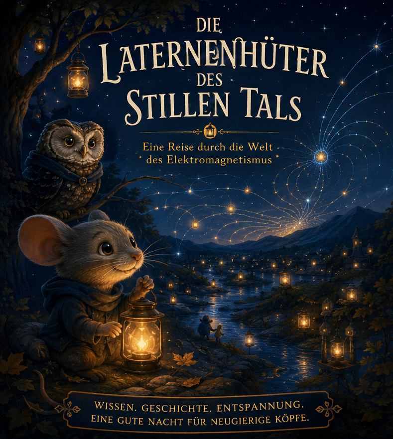

# Die Laternenhüter des Stillen Tals

## Prämisse
In einem friedlichen Tal pflegen kleine Waldtiere leuchtende Laternen, die die Nacht erhellen. Die junge Maus Pip wird Lehrling der Laternenhüter.

Die Laternen funktionieren durch geheimnisvolle Kräfte, die niemand vollständig versteht.

Während Pip das Tal erkundet, entdeckt er Schritt für Schritt die verborgenen Regeln von Elektrizität, Magnetismus und Licht – dieselben Regeln, die unser echtes Universum bestimmen.

## Episodenabfolge
1. [Episode 1 – Die Nacht, in der die Laternen funkelten](01_Episode_1_Die_Nacht_in_der_die_Laternen_funkelten.md)
2. [Episode 2 – Der Wald der tanzenden Nadeln](02_Episode_2_Der_Wald_der_tanzenden_Nadeln.md)
3. [Episode 3 – Der Fluss unter dem Fluss](03_Episode_3_Der_Fluss_unter_dem_Fluss.md)
4. [Episode 4 – Das Meer des Sternenlichts](04_Episode_4_Das_Meer_des_Sternenlichts.md)

## Gestaltungsprinzipien (Bedtime-Stil)
- Jede Episode erweitert das Wissen um genau eine konzeptionelle Schicht.
- Eine sanfte, fortlaufende Geschichte mit wiederkehrenden Figuren trägt das Lernen.
- Jede Episode endet mit einem kleinen Rätsel als natürlicher Übergang.
- Bildhafte Sprache statt Gleichungen.
- Ruhige, warme Atmosphäre bei gleichzeitig echter inhaltlicher Tiefe.

## Wiederkehrende Figuren
- **Pip** (junge Maus, Lehrling)
- **Rowan** (alte Eule, weise Erklärstimme)
- **Jun** (Fuchs-Ingenieur, praktischer Tüftler)

## Weiterführende Notizen
- [Serienabschluss](90_Serienabschluss.md)
- [Warum diese Struktur funktioniert](99_Warum_diese_Struktur_funktioniert.md)
