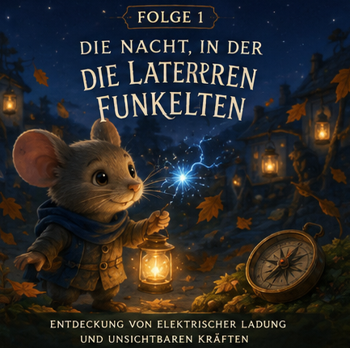

# Episode 1 – Die Nacht, in der die Laternen funkelten

## Wissenschaftsziel
Einführen von:
- elektrischer Ladung
- Anziehung und Abstoßung
- statischer Elektrizität
- elektrischem Feld (intuitiv)

## Story
Pip bemerkt, dass trockene Herbstblätter seltsam stark an seinem Wollschal haften.

Später, beim Polieren von Laternenglas, erscheinen kleine blaue Funken.

Die alte Eule Rowan erklärt, dass es zwischen manchen Dingen unsichtbare „Vorlieben“ gibt:
- Manche Dinge möchten zueinander.
- Andere stoßen sich sanft ab.

Auf seinem Heimweg stellt sich Pip vor, dass jedes Objekt von einem unsichtbaren Einfluss umgeben ist, der in die Dunkelheit hinausreicht.

## Wissenstransfer (ohne harte Fachsprache)
- Materie kann elektrische Ladung tragen.
- Entgegengesetzte Ladungen ziehen sich an.
- Gleichartige Ladungen stoßen sich ab.
- Ladungen beeinflussen den Raum in ihrer Nähe.
- Ein Feld erscheint als „unsichtbares Flüstern“ um Dinge herum.

## Bedtime-Bildsprache
Die Funken knistern nur kurz, wie winzige Sternsplitter auf Glas.

## Schlussrätsel
In der Nacht findet Pip einen seltsamen Steinkompass.

Er bewegt sich von selbst.

Kein elektrischer Funke berührt ihn.

Etwas völlig anderes scheint zu ziehen.
