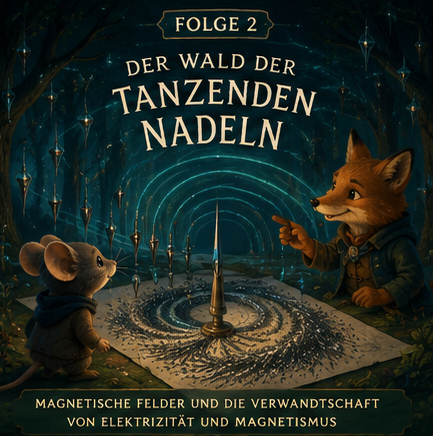

# Episode 2 – Der Wald der tanzenden Nadeln

## Wissenschaftsziel
Einführen von:
- Magnetismus
- magnetischen Polen
- magnetischen Feldern
- Beziehung und Unterschied zwischen Elektrizität und Magnetismus

## Story
Der Kompass führt Pip in einen Wald, in dem tausende silberne Nadeln an Ästen hängen.

Jede Nacht drehen sie sich langsam gemeinsam.

Der Fuchs-Ingenieur Jun erklärt, dass bestimmte Steine unter dem Waldboden unsichtbare Muster erzeugen.

Die Tiere streuen Eisenfeilspäne auf Pergament und beobachten, wie wunderschöne Formen entstehen.

Pip erkennt: Das unsichtbare „Flüstern“ um Magnete sieht dem unsichtbaren Einfluss elektrischer Ladung überraschend ähnlich.

## Wissenstransfer
- Magnete besitzen Pole.
- Magnetfelder erfüllen den Raum.
- Magnetfelder können Dinge ohne Berührung führen.
- Elektrische und magnetische Effekte wirken seltsam verwandt.

## Bedtime-Bildsprache
Das Magnetfeld wird zu einem sanften Fluss im Wald.

Die Nadeln treiben nur mit seiner Strömung.

## Schlussrätsel
Eines Nachts rollt versehentlich ein Kupferrad durch das Feld.

Eine Laterne leuchtet auf.

Niemand hat sie berührt.

Niemand hat einen Funken geschlagen.

Das Tal ist ratlos.
