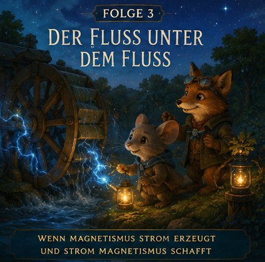

# Episode 3 – Der Fluss unter dem Fluss

## Wissenschaftsziel
Einführen von:
- elektrischem Strom
- Elektromagnetismus
- Induktion
- Generatoren
- Motoren (konzeptionell)

## Story
Pip untersucht die rätselhafte Laterne.

Jun hilft beim Bau eines Wasserrads am Bach.

Immer wenn sich das Rad dreht, beginnen nahe Laternen zu leuchten.

Die Tiere entdecken: Bewegte Magnete können Elektrizität erzeugen.

Später entdecken sie auch das Gegenteil:
Elektrizität kann Magnetismus erzeugen.

Dem Tal wird langsam klar, dass dies keine getrennten Kräfte sind.

Es sind zwei Seiten desselben verborgenen Flusses.

## Wissenstransfer
- Elektrischer Strom ist bewegte Ladung.
- Bewegte Ladungen erzeugen Magnetfelder.
- Veränderte Magnetfelder können elektrische Ströme erzeugen.
- Generatoren und Motoren sind Spiegelbilder.

## Bedtime-Bildsprache
Das Tal ruht auf einem riesigen unsichtbaren Fluss.

Manchmal fließt er als Elektrizität.

Manchmal kringelt er sich zu Magnetismus.

Manchmal verwandelt er sich vom einen ins andere.

## Schlussrätsel
Während eines Sturms glühen die Laternen auf, noch bevor ein Blitz einschlägt.

Erst Augenblicke später zuckt ein heller Blitz in der Ferne.

Woher wussten die Laternen, was kommt?
