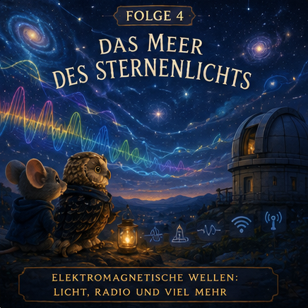

# Episode 4 – Das Meer des Sternenlichts

## Wissenschaftsziel
Einführen von:
- elektromagnetischen Wellen
- Licht als Elektromagnetismus
- Radiowellen
- Spektrum
- vereintem Gesamtverständnis

## Story
Rowan, die Eule, öffnet Pip die Tür zu einer alten Sternwarte auf dem Hügel.

Dort lernt Pip: Elektrizität und Magnetismus können sich unaufhörlich gegenseitig erzeugen.

Wenn das geschieht, wandert eine Welle durch den Raum selbst.

Diese Wellen sind Licht.

Das warme Leuchten der Laternen.

Das Mondlicht auf dem Fluss.

Die Farben der Blumen.

Das ferne Funkeln der Sterne.

Die Tiere entdecken, dass sichtbares Licht nur ein kleiner Bereich in einem riesigen Ozean elektromagnetischer Wellen ist.

## Wissenstransfer
- Ändernde elektrische Felder erzeugen magnetische Felder.
- Ändernde magnetische Felder erzeugen elektrische Felder.
- Gemeinsam bilden sie elektromagnetische Wellen.
- Licht, Radio, Mikrowellen und Röntgenstrahlung sind dasselbe Phänomen bei unterschiedlichen Wellenlängen.

## Bedtime-Bildsprache
Pip stellt sich den Kosmos als ruhigen Mitternachtsozean vor.

Sterne leuchten nicht nur.

Sie senden sanfte Wellen über unvorstellbare Entfernungen.

Jede Laterne im stillen Tal ist Teil desselben großen Meeres.

## Schlussübergang
Weiter zu: [Serienabschluss](90_Serienabschluss.md)
